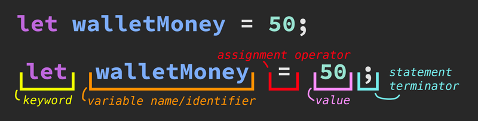

# **Project Overview**

## **Dog Food Calculator**

- **Purpose:** To help pet parents calculate the ingredients and ratios needed to make nutritionally balanced home-cooked dog food based on their dog's weight, age, and activity level.

### **Tech Stack:**

- **Frontend:** React, ReactRouter, ReactHookForm
- **Backend:** Flask, Flask-Login
- **Database:** MySQL
- **UI/UX:** HTML, CSS, Bootstrap

### **Key Features**

- **Secure Login:** Users can use the application as a guest, or preferentially create an account they can log into and save favorite recipes.
- **Input Fields:**
  - Name (text field)
  - Weight (text field, numbers only)
  - Weight Type (dropdown - e.g., lb, kg)
  - Age (text field, numbers only)
  - Activity level (dropdown - e.g., low, medium, high)
  - Ingredients - Good (checkboxes for selecting common ingredients that must be included in the recipe)
  - Ingredients - Bad (checkboxes for selecting common allergens that must not be included in the recipe)
- **Ratio Calculation:** Based on input fields, create a recipe that accounts for the selected good and bad ingredients, and then automatically select additional ingredients to round out and generate a nutritionally balanced meal.
- **Output:** Display the calculated quantities of each ingredient in grams and/or cups. Provide a breakdown of nutritional content, and recommend a serving size and feeding schedule.
- **Save Recipes:** Allow users to save their recipes for future reference.

### **Views**

- **Landing Page:** Brief introduction to the dog food recipe app and its purpose, with CTAs leading to the login/register form and the recipe creator form.
- **Register Form:** Fields for email, name, and password.
- **Login Form:** Fields for email and password.
- **Recipe Form:** Fields for name, weight, weight type, age, activity level, and ingredient selection.
- **Results Page:** Display the calculated recipe with a clean, easy-to-read layout, including the option to go back, re-adjust inputs, and recalculate. Persist previous data in fields.

### **Stretch Goals**

- **Printable Recipe:** Generate a print-friendly recipe card.
- **Puppy Profiles:** Allow users to create and save profiles, including profile image upload, for their pets.

### **Free APIs That Might Be Helpful**

- [Edamam Nutrition API](https://developer.edamam.com/edamam-nutrition-api) - 400 rq/mo
- [USDA FoodData Central API](https://fdc.nal.usda.gov/api-guide.html) - 1000 rq/hr
- [Open Pet Food Facts API](https://us.openpetfoodfacts.org/data) - Unlimited rq, within reason
- [The Dog API](https://thedogapi.com/) - 10,000 rq/mo

---

### **Come on! We can do this!**

So, why are we building a Dog Food Calculator? Well, the idea is that this isn't just another random coding project thrown together for kicks, this is something we might actually use - a tool we can take to the grocery store and the kitchen in the real world, something that does more than just sit and gather digital dust like yet another to-do list app.

Helping pet parents create the best meals for their furry four-legged kids? I think that's a worthy goal. And this tool is going to help us do just that by calculating the perfect blend of ingredients for a nutritious, home-cooked meal.

But beyond that, this project is like a full-stack development crash course: we're going to get hands-on with all the key skills: collecting and handling user input, doing the math to make those nutritional calculations, managing data, and then putting it all together in a way that's clean, smooth, and user-friendly. So this is a "nutritionally balanced" project, too - backend logic, database management, frontend design, and more.

And here's the best part: it's not too big to be overwhelming, but it's complex enough to give you a solid understanding of how all the pieces fit together. Plus, let's be honest - who wouldn't want to build something that's both fun and actually useful? That's why we're doing a Dog Food Calculator.

So, whether you're coming to this project fresh-faced and new to coding, or you just want a refresher on how full project like this comes together from start to finish, this is going to take us through the whole process, step by step, and feel free to tackle it at your own pace. No rush, no stress - just focus on learning and building something cool and useful.

<br />

---
---
---
<br />

# **Piece by Piece**

Building up an app of this scale when we're starting from ground zero may seem daunting, but we're going to attack it atomically - that is, let's break it down piece by piece, step by step. Taken in small, easy-to-swallow bites, this Dog Food Calculator will be done before you know it.

### **Part 1: Getting Our Feet Wet (No Dog Water Necessary)**

### **Purpose:**
Calculating the amount of protein required for a dog based on its weight and activity level using JavaScript.

### **Learning Objectives:**
Core JavaScript skills such as variables, operators, strings, conditionals, functions, and loops.

### **Resources:**
- [MDN JavaScript Guide](https://developer.mozilla.org/en-US/docs/Learn/JavaScript)
- [MDN JavaScript Docs](https://developer.mozilla.org/en-US/docs/Web/JavaScript)

---

## **JavaScript: Foundational Concepts**

Before we dive into building the protein calculation portion of our Dog Food Calculator, let's take a look at some core JavaScript concepts that we'll need.

### **1. Variables**

Variables are used to store information that can be reused throughout our code. But what does that mean? Okay, imagine we have a big box with designated space to write a label on it. This box can hold anything we want - a single sock or a million rubber duckies: it really can hold anything! - but in the context of coding, it's gonna hold *data* of some kind. In JavaScript, a **variable** is like a box. It's a place where we can store some important information that we want to use later.

Let's say we want to remember how much money we have in a wallet. We could put that amount in a box labeled "walletMoney" so we don't forget it. In JavaScript, it might look like this:

```javascript
let walletMoney = 50;
```

Here, `let walletMoney = 50;` means we've created a box labelled `walletMoney` and put the number `50` inside it - in code-speak, we've *declared* the variable `walletMoney` and set its *value* t0 `50`. Anytime we need to check how much money we have, we just open the box - or, *call* the variable and can see that we've got $50!

We can also change what's in the box whenever we want. If we spend $10 and now have $40 left, we just update the box:

```javascript
walletMoney = 40;
```

Now, the box `walletMoney` holds the number `40` instead. That's basically how a variable works in JavaScript! It's a box where we can store information, and we can *call* it later whenever we need it. Notice the difference between when we *declared* the variable - using the *keyword* `let` and *setting* `walletMoney` to `50` versus when we *reassigned* the variable `walletMoney` to `40`? Let's examine the parts of a variable *declaration* more closely, now, to really understand what's happening here.

### Anatomy of a Variable:


Notice we have the *keyword* `let` at the beginning when we *declare* a variable. This is like us actively writing the label, or *variable name* on our "box". When we *call* the variable later, and *set* the value for instance from `50` to `40`, we do not use the keyword again - the box has already been labelled!

### Curveball
Of course, there's a curveball! Let's go fetch! `let` isn't the only variable *setting* keyword in JavaScript. We also use the keyword `const`. What's the difference? Well, as you might've noticed, `const` shares the root of the word "constant" - we use this for variables whose values we need to store, but are certain the values will never change. For example, I wouldn't want to declare a variable like `let penny = 0.01;` - some one could come along later in our code and pull an Office Space to reassign the value of a penny to `0.1` or anything they want! It's better to declare an unchanging value like this with `const` - so, `const penny = 0.01;` would be more accurate and much safer. One more curveball! You may occasionally see `var` used as a variable-declaring keyword in old code - though it functions similarly to `let`, this has been *deprecated* (fallen out of favour and no longer used currently) and should be avoided these days!

### Key Terms

**Keyword** - a reserved word in JavaScript that has a specific meaning. Keywords are used to perform actions in the language. In the statement `let walletMoney = 50;`, the word `let` is a keyword that is used to declare a new variable. We can also use `const` for variables whose values will not change, as in `const penny = 0.01;`

**Variable Name** - also known as an identifier, a name given to a variable to uniquely identify it in our code. It allows us to refer to the stored value by name. In `let walletMoney = 50;`, `walletMoney` is the variable name, allowing us to access or modify the value stored in that variable.

**Assignment Operator** - the assignment operator (`=`) is used to assign a value to a variable. In the statement `let walletMoney = 50;`, the `=` is the assignment operator that assigns the value `50` to the variable `walletMoney`.

**Value** - data assigned to a variable, which can be a *number*, *string*, *object*, etc. In `let walletMoney = 50;`, `50` is the *value* assigned to the variable `walletMoney`.

**Statement** - a syntactical unit of code that expresses an action to be carried out. `let walletMoney = 50;` is an example of a statement, as it declares a variable and assigns it a value.

**Statement Terminator** - a character that indicates the end of a statement - in other words, we have nothing else to add to the idea we've just `declared`. In JavaScript and other languages that use statement terminators, a semicolon (`;`) is typically used.

### Resources
- [MDN Variables Guide](https://developer.mozilla.org/en-US/docs/Learn/JavaScript/First_steps/Variables)
- [MDN Grammar and Types](https://developer.mozilla.org/en-US/docs/Web/JavaScript/Guide/Grammar_and_types)
- [MDN `let` Keyword](https://developer.mozilla.org/en-US/docs/Web/JavaScript/Reference/Statements/let)
- [MDN `const` Keyword](https://developer.mozilla.org/en-US/docs/Web/JavaScript/Reference/Statements/let)

---

### **2. Operators**

Alright, let's talk about **operators** - these are the tools we use to work with the values in our variables. Think of operators as the verbs in our code - they do the actions like adding, subtracting, comparing, and so on.

#### **Arithmetic Operators**
These are the core operators, the ones we'll reach for regularly when we're doing math in our code.

- **Addition (`+`)**: Adds two numbers together.
    ```javascript
    let totalCost = 20 + 30; // totalCost is 50
    ```
- **Subtraction (`-`)**: Subtracts one number from another.
    ```javascript
    let remainingMoney = 50 - 20; // remainingMoney is 30
    ```
- **Multiplication (`*`)**: Multiplies two numbers together.
    ```javascript
    let totalProtein = 5 * 10; // totalProtein is 50
    ```
- **Division (`/`)**: Divides one number by another.
    ```javascript
    let perServing = 50 / 2; // perServing is 25
    ```

#### **Comparison Operators**
These operators compare two values and return a true or false value (aka *boolean*).

- **Equal (`==`)**: Checks if two values are equal.
    ```javascript
    let isEqual = (walletMoney == 50); // isEqual is true because walletMoney is 50
    ```
- **Strict Equal (`===`)**: Checks if two values are equal **and** of the same type (aka *deeply equal*).
    ```javascript
    let isDeeplyEqual = (walletMoney === 50); // true, because walletMoney is exactly 50 AND a number
    ```
- **Not Equal (`!=`)**: Checks if two values are not equal.
    ```javascript
    let isNotEqual = (walletMoney != 30); // true, because walletMoney is not 30
    ```

#### **Assignment Operators**
We've already met the basic assignment operator (`=`), but there are others that can do more with less!

- **Add and Assign (`+=`)**: Adds a value to a variable and then assigns the result back to that variable.
    ```javascript
    walletMoney += 20; // walletMoney is now 70 (50 + 20)
    ```
- **Subtract and Assign (`-=`)**: Subtracts a value from a variable and then assigns the result back to that variable.
    ```javascript
    walletMoney -= 10; // walletMoney is now 60 (70 - 10)
    ```

### **Curveball**
Just like with variables, there’s a little more to operators than what we’ve covered so far. Let’s chase down this curveball: while we’ve focused on arithmetic and comparison operators, there are many other types, including **logical operators** (like `&&` and `||`), **bitwise operators**, and **ternary operators**. These allow us to perform more complex operations and make decisions in our code with even more precision. For instance, logical operators help us combine multiple conditions, while the ternary operator offers a shorthand way to write an `if-else` statement - but we'll get to these in more detail, later! Just something to keep in mind.

### **Key Terms**

**Deeply Equal (`===`)** - In JavaScript, `===` is known as the *strict equality operator*, which not only checks if two values are equal but also ensures that they are of the same type. For instance, `5 === "5"` would return `false` because even though the values look the same, one is a number and the other is a string. This is different from the two-equal-sign `==`, which would return `true` in the case of `5 === "5"` because it only checks for the equality of the values, not the types.

**Boolean** - A boolean is a data type that can only be `true` or `false`. In JavaScript, comparison operators like `==` or `!=` return a boolean value. For example, `let isEqual = (walletMoney == 50);` assigns `true` to `isEqual` if `walletMoney` equals `50`.

**Compound Assignment Operators** - These are shorthand operators that combine an arithmetic operation with assignment. For example, `+=` adds and then assigns the new value to the variable. So, `walletMoney += 20;` is shorthand for `walletMoney = walletMoney + 20;`.

**Operator Precedence** - This refers to the order in which operations are evaluated in an expression. For example, in the expression `2 + 3 * 4`, the multiplication happens first, resulting in `2 + 12`, and then the addition, resulting in `14`. Operator precedence determines how expressions are grouped and which parts of the expression are evaluated first.

**Truthy and Falsy Values** - In JavaScript, every value is inherently "truthy" or "falsy" when evaluated in a boolean context. A value is "truthy" if it evaluates to `true` in a boolean context, and "falsy" if it evaluates to `false`. Common "falsy" values include `0`, `""` (an empty string), `null`, `undefined`, and `NaN` (Not-a-Number). For example, in an if statement like `if (walletMoney)`, the condition will pass if `walletMoney` is truthy (like `50`), and fail if it is falsy (like `0`).

**Chaining Comparisons** - Sometimes, we might want to check multiple conditions at once. For example, we might want to know if a value falls within a certain range: `if (x > 0 && x < 100)`. Here, the `&&` operator ensures that both conditions must be true for the entire statement to be true.

### **Resources**
- [MDN Expressions and Operators Guide](https://developer.mozilla.org/en-US/docs/Web/JavaScript/Guide/Expressions_and_Operators)
- [MDN Arithmetic Operators](https://developer.mozilla.org/en-US/docs/Web/JavaScript/Reference/Operators/Arithmetic_Operators)
- [MDN Comparison Operators](https://developer.mozilla.org/en-US/docs/Web/JavaScript/Reference/Operators/Comparison_Operators)
- [MDN Assignment Operators](https://developer.mozilla.org/en-US/docs/Web/JavaScript/Reference/Operators/Assignment)

---

### **3. Strings**

Next up: *strings*. Simply put, these are just sequences of *characters*, wrapped up in quote marks, that we can manipulate to say what we want.

#### **Creating Strings**
Strings are created by wrapping text in quotes - either single (`'`) or double (`"`), but let’s pick one and stick with it for consistency.

- **Basic Example:**
    ```javascript
    let dogName = "Buddy";
    ```
    Here, `dogName` holds the string `"Buddy"`.

#### **String Concatenation**
This fancy word just means "sticking strings together."

- **Concatenation with `+`:**
    ```javascript
    let greeting = "Hello, " + dogName + "!";
    // greeting is now "Hello, Buddy!"
    ```

#### **Template Literals**
For cleaner, more readable code, especially when combining strings and variables, we can use *template literals*. These are strings wrapped in backticks " \` " (look for the `~` on your keyboard to find it) instead of quotes.

- **Example with Template Literals:**
    ```javascript
    let welcomeMessage = `Welcome, ${dogName}! You have $${walletMoney} in your wallet.`;
    ```
    Here, `${dogName}` and `${walletMoney}` are placeholders that JavaScript replaces with the values of those variables. If `dogName` is set to `"Buddy"` and `walletMoney` is set to `60`, then this would render `"Welcome, Buddy! You have $60 in your wallet."`

### **Curveball**
Strings can be tricky when it comes to handling special characters or long blocks of text. To include a quote within a string, we need to escape it using a backslash (`\`). For example, `"He said, \"Hello!\""` will correctly display the quotes around "Hello!" inside the string. Another curveball is the difference between single (`'`) and double (`"`) quotes—both work to define strings, but we must be consistent in their use. Also, if we need to handle multi-line text, template literals (using backticks `` ` ``) come in handy as they allow for easier formatting and inclusion of variables.

### **Key Terms**

**Concatenation** - The process of joining two or more strings together. While the `+` operator is commonly used, be mindful of its behavior when used with non-string types, as it can lead to unintended type coercion (e.g., `"5" + 5` results in `"55"`).

**Escape Characters** - Special characters in strings that are preceded by a backslash (`\`). They allow us to include characters that would otherwise be difficult to represent, such as `\"` for double quotes inside a string or `\n` for a new line.

**Template Literals** - Strings wrapped in backticks ( \` ) that allow us to embed expressions inside strings using `${}`. Useful for multi-line strings or when embedding variables directly within a string.

**Immutability** - Strings in JavaScript are immutable, meaning once a string is created, it cannot be changed. Operations that appear to modify a string, like `.slice()`, actually create a new string.

### **Resources**
- [MDN String Guide](https://developer.mozilla.org/en-US/docs/Web/JavaScript/Guide/Grammar_and_types#string_type)
- [MDN Template Literals](https://developer.mozilla.org/en-US/docs/Web/JavaScript/Reference/Template_literals)
- [MDN String Methods](https://developer.mozilla.org/en-US/docs/Web/JavaScript/Reference/Global_Objects/String)

---

### **4. Conditionals**

Sometimes, our code needs to make decisions depending on the current *condition* of our data - enter the **conditionals**. These are the choice-makers in our code, helping us select different paths based on the situation.

#### **If Statements**
The most basic conditional is the `if` statement. It checks a condition and runs the code inside it if the condition is true.

- **Basic If Statement:**
    ```javascript
    if (walletMoney > 0) {
        console.log("We have money to spend!");
    }
    ```
    This code checks if `walletMoney` is greater than `0`. If it is, it logs the message.

#### **Else Statements**
What if the condition isn't true? That's where `else` comes in.

- **If...Else Example:**
    ```javascript
    if (walletMoney > 0) {
        console.log("We have money to spend!");
    } else {
        console.log("We're broke!");
    }
    ```
    Now, if `walletMoney` is `0` or less, it’ll log `"We're broke!"` instead.

#### **Else If Statements**
If we have more than one condition to check, use `else if`.

- **If...Else If...Else Example:**
    ```javascript
    if (walletMoney > 100) {
        console.log("We're loaded!");
    } else if (walletMoney > 0) {
        console.log("We have some spending money.");
    } else {
        console.log("We're broke!");
    }
    ```

### **Curveball**
One curveball with conditionals is understanding **truthy** and **falsy** values in JavaScript. These are non-boolean values that JavaScript treats as `true` or `false` when used in a boolean context (like inside an `if` statement). For instance, the number `0`, an empty string (`""`), `null`, `undefined`, and `NaN` are all falsy, while most other values are truthy. This can lead to unexpected behavior if we’re not careful when writing our conditions.

### **Key Terms**

**Truthy and Falsy Values** - In JavaScript, every value is either truthy or falsy in a boolean context. Common falsy values include `0`, `""` (empty string), `null`, `undefined`, `NaN`, and `false`. Everything else is truthy.

**Ternary Operator** - A concise way to perform conditional checks in JavaScript. It’s a shorthand for `if-else` statements and follows the syntax: `condition ? expressionIfTrue : expressionIfFalse`.

**Short-Circuit Evaluation** - A technique in logical expressions where JavaScript stops evaluating as soon as the outcome is determined. For example, in `a && b`, if `a` is false, `b` is never evaluated.

**Switch Statement** - An alternative to multiple `if-else` statements when comparing the same variable against multiple values. Remember to use `break` to prevent fall-through, unless you intend to match multiple cases.

### **Resources**
- [MDN If-Else Statements](https://developer.mozilla.org/en-US/docs/Web/JavaScript/Reference/Statements/if...else)
- [MDN Switch Statement](https://developer.mozilla.org/en-US/docs/Web/JavaScript/Reference/Statements/switch)
- [MDN Ternary Operator](https://developer.mozilla.org/en-US/docs/Web/JavaScript/Reference/Operators/Conditional_Operator)

---

### **5. Loops**

**Loops** are all about repetition - doing the same thing over and over again, but with a twist each time.

#### **For Loops**
A `for` loop is like a robot that keeps working until we tell it to stop.

- **Basic For Loop:**
    ```javascript
    for (let i = 1; i <= 5; i++) {
        console.log(`This is loop number ${i}`);
    }
    ```
    Here, `i` starts at `1`, and the loop runs until `i` is greater than `5`. Each time, it logs the current loop number.

#### **While Loops**
A `while` loop keeps running as long as a certain condition is true.

- **Basic While Loop:**
    ```javascript
    let countdown = 5;
    while (countdown > 0) {
        console.log(countdown);
        countdown--;
    }
    console.log("Liftoff!");
    ```
    This loop counts down from `5` to `1`, then prints `"Liftoff!"`.

### **Curveball**
A common challenge with loops is avoiding **infinite loops**—loops that never end because the condition for stopping them is never met. This can happen if we forget to update the loop variable or set the stopping condition incorrectly. Infinite loops can crash our program, so it's important to ensure that our loop conditions will eventually be false.

### **Key Terms**

**Infinite Loop** - A loop that never terminates because the terminating condition is never met. This can cause the program to crash or become unresponsive, so always ensure loop conditions will eventually be false.

**Loop Control Statements** - Keywords like `break` and `continue` that alter the normal flow of a loop. `break` exits the loop entirely, while `continue` skips to the next iteration without finishing the current one.

**Iteration** - A single execution of the loop’s body. For example, in a `for` loop, each time the loop runs and performs its block of code, that’s one iteration.

**Do-While Loop** - A variant of the `while` loop that guarantees the loop body runs at least once because the condition is checked after the loop has executed.

### **Resources**
- [MDN Loops and Iteration](https://developer.mozilla.org/en-US/docs/Web/JavaScript/Guide/Loops_and_iteration)
- [MDN For Loop](https://developer.mozilla.org/en-US/docs/Web/JavaScript/Reference/Statements/for)
- [MDN While Loop](https://developer.mozilla.org/en-US/docs/Web/JavaScript/Reference/Statements/while)

---

Now that we've explored these concepts, let's start applying them to our Dog Food Calculator project. In the next part, we'll use these fundamentals to build a JavaScript *function* that calculates the amount of protein a dog needs based on its weight and activity level.
